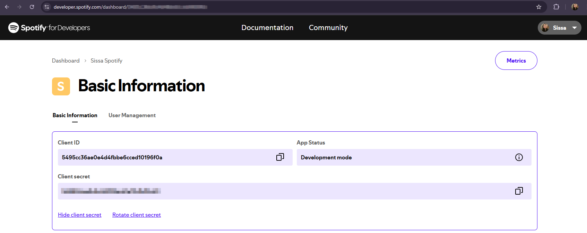
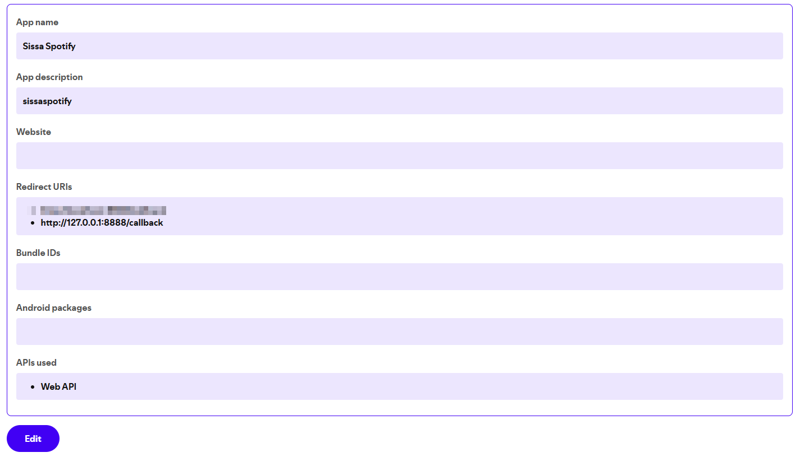

# 🎧 Watch Mix – Automatic Spotify Playlist

This project generates a playlist called **Watch Mix** with random tracks from your liked songs on Spotify. It's updated daily, always using the **same ID**, ideal for syncing with the **Apple Watch** without creating duplicate playlists.

---

## 🚀 Features

* Randomly selects 30 tracks from your liked songs library
* Replaces the contents of a single existing playlist (no duplicates created)
* Automates execution with **GitHub Actions** (daily run)
* Uses **Poetry** for dependency management

---

## 📦 Prerequisites

* Python 3.12 or higher
* An account on the [Spotify Developer Dashboard](https://developer.spotify.com/dashboard)
* A GitHub repository (optional, for automatic scheduling)


## ⚙️ Installation and setup

> All steps below should be done via **PowerShell** on Windows.

### 1. Create a project folder

The commands below automatically go to your Desktop, create a new folder called `playlist-spotify-watchmix`, and enter it.
If you'd rather create the folder somewhere else (like `Documents`, `Downloads`, or another directory), you can skip these commands. Just create the folder manually wherever you want, open **PowerShell inside it**, and continue from **step 2** normally.

Open Windows **PowerShell** and run the commands below to create and enter the project folder:

```powershell
cd ([Environment]::GetFolderPath('Desktop'))
```

```powershell
mkdir playlist-spotify-watchmix
```

```powershell
cd playlist-spotify-watchmix
```

> This will create a folder called `playlist-spotify-watchmix` on your desktop and put you inside it.

### 2. Clone the repository and go to the script folder

```powershell
git clone https://github.com/Sissaz/playlist-spotify-watchmix.git
```

```powershell
cd playlist-spotify-watchmix\src\assets
```

### 3. Install dependencies with Poetry

```powershell
poetry install
```

---

## ▶️ Manual run

Activate the virtual environment:

```powershell
poetry shell
```

Run the script:

```powershell
poetry run python gerar_watch_mix.py
```

### 3. First run: provide your Spotify credentials

The first time you run the script, you'll be asked for:

* `CLIENT_ID`
* `CLIENT_SECRET`
* `REDIRECT_URI` (e.g. `http://127.0.0.1:8888/callback`)

These values come from registering your app on the [Spotify Developer Dashboard](https://developer.spotify.com/dashboard).





> After this step, the script will open a browser window to authorize access to your account. The token is saved automatically to `.env`.

On the second run, the script will automatically create the **Watch Mix** playlist (if it doesn't exist yet) and update the `.env` file with the `PLAYLIST_ID`.

---

## ⏰ Automatic execution (via GitHub Actions)

This project already includes a workflow: `.github/workflows/watch_mix.yml`, which runs the script **daily** automatically (05:00 BRT / 08:00 UTC).

For the workflow to work, the repository needs these secrets under **Settings > Secrets and variables > Actions**:

```
SPOTIFY_CLIENT_ID
SPOTIFY_CLIENT_SECRET
SPOTIFY_REDIRECT_URI
SPOTIFY_REFRESH_TOKEN
PLAYLIST_ID
```

You can create them in two ways:

### Option A — automatic (recommended)

1. Create a GitHub [Personal Access Token](https://github.com/settings/personal-access-tokens/new), scoped to this repository only, with **Secrets: Read and write** permission.
2. Add that token to your local `.env`: `GH_PAT=<your_token>`.
3. Run the script locally once (`poetry run python gerar_watch_mix.py`) and authorize in the browser when prompted.

The script itself publishes all the secrets above automatically to the repository (including `GH_PAT`, so the workflow can later update itself if Spotify ever issues a new refresh token). No manual secret creation is needed.

### Option B — manual

If you'd rather not create a PAT, create each secret manually under **Settings > Secrets and variables > Actions > New repository secret**, copying the values from your local `.env` after the first run (`REFRESH_TOKEN` and `PLAYLIST_ID` only exist after running the script at least once).

### If the token breaks (access revoked, secret rotated, etc.)

Run the script locally again (`poetry run python gerar_watch_mix.py`). If the saved refresh token is invalid, the script detects it automatically and opens the browser for a new authorization — no need to manually clear anything in `.env`. With `GH_PAT` set, the new token is published automatically to the GitHub secret.

---

## ⏲️ Schedule (cron)

The current schedule is set to run every day at 08:00 UTC (05:00 BRT):

```
0 8 * * *
```

You can change this schedule in `.github/workflows/watch_mix.yml` as needed.
